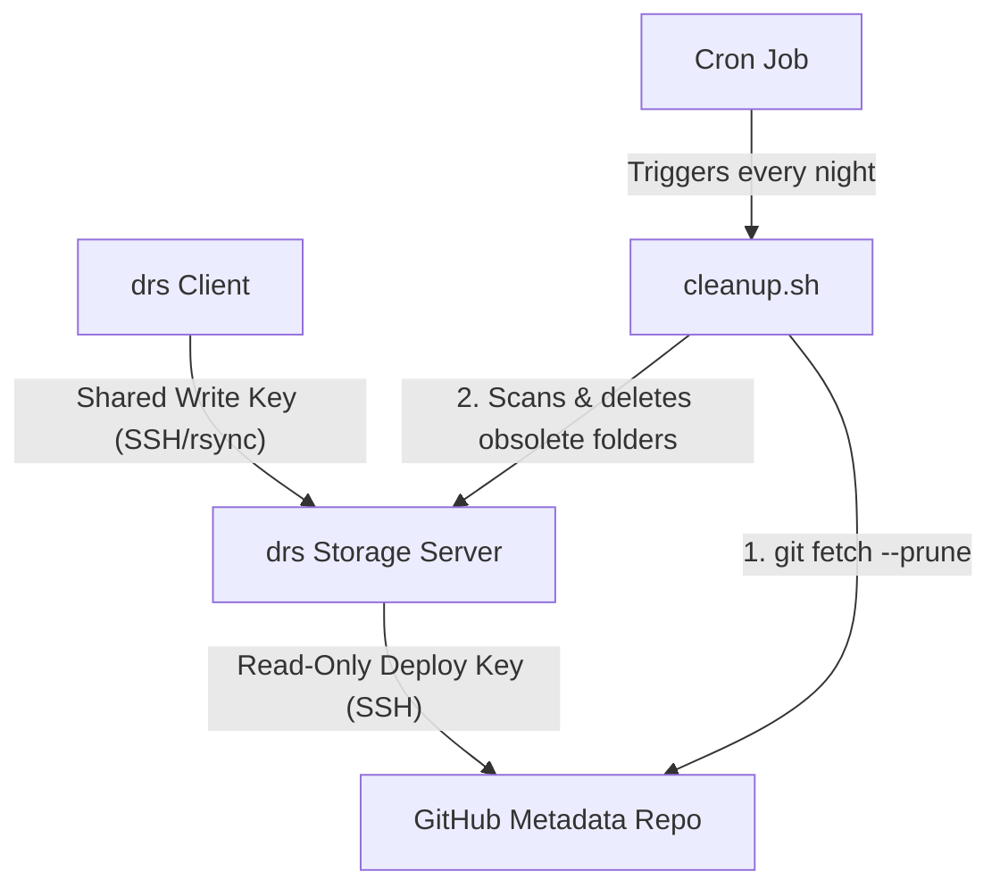

# Storage Cleanup Setup Guide

This guide describes how to configure the server-side cleanup utility (`cleanup.sh`) to automatically manage storage revisions on your `drs` hosting server when using GitHub for metadata storage.

It uses a dedicated, read-only SSH Deploy Key to fetch metadata from GitHub securely, keeping it separate from the shared `drs` client key.

## Architecture Overview



---

## Step-by-Step Configuration

### Step 1: Generate a Server-Specific SSH Key
Log in to your storage server as the `drs` user and create a dedicated SSH key for accessing GitHub.

```bash
ssh-keygen -t ed25519 -f ~/.ssh/github_drs_read_only -C "drs-server-cleanup"
```
*Note: Press Enter to skip the passphrase so the automated cron job can authenticate without prompting.*

### Step 2: Add the Deploy Key to GitHub
1. Copy the public key content:
   ```bash
   cat ~/.ssh/github_drs_read_only.pub
   ```
2. Navigate to your repository on GitHub.
3. Go to **Settings** -> **Deploy keys** (under *Security*).
4. Click **Add deploy key**.
5. Title it `DRS Storage Server Cleanup`.
6. Paste the public key.
7. **Leave "Allow write access" unchecked** to enforce read-only access.
8. Click **Add key**.

### Step 3: Configure the SSH Client Host Alias
To ensure the server uses this specific key when communicating with GitHub, add a host alias to the `drs` user's `~/.ssh/config` file:

```ssh-config
Host github.com-drs
    HostName github.com
    User git
    IdentityFile ~/.ssh/github_drs_read_only
    IdentitiesOnly yes
```

### Step 4: Clone the Metadata Repository
Create a **bare clone** of the repository on the storage server using the configured SSH host alias. This bare clone stores the branch and tag history without checking out the project files.

```bash
git clone --bare git@github.com-drs:username/your-metadata-repo.git /home/drs/drs-metadata.git
```

### Step 5: Automate with Cron
Add a cron job to the `drs` user's crontab to update the metadata and run the cleanup script daily.

1. Open the crontab editor:
   ```bash
   crontab -e -u drs
   ```
2. Add the following line (configures cleanup to run every night at 2:00 AM):
   ```cron
   0 2 * * * git --git-dir=/home/drs/drs-metadata.git fetch origin --prune --tags && /home/drs/cleanup.sh --days 30 --commits 5 /home/drs/drs-metadata.git /home/drs/drs-home/myproject >> /home/drs/drs-cleanup.log 2>&1
   ```

---

## Security & Maintenance Notes

### Separation of SSH Keys
* **Inbound Access (Client -> Server)**: Clients connect using the shared write key. The storage server only holds their public key in `authorized_keys`.
* **Outbound Access (Server -> GitHub)**: The storage server connects to GitHub using the dedicated private key `github_drs_read_only`.
* **Benefit**: If you ever need to revoke or rotate the client shared key (e.g. if a team member leaves), you only need to modify `authorized_keys` on the storage server. The cron job's connection to GitHub remains functional and unchanged.
